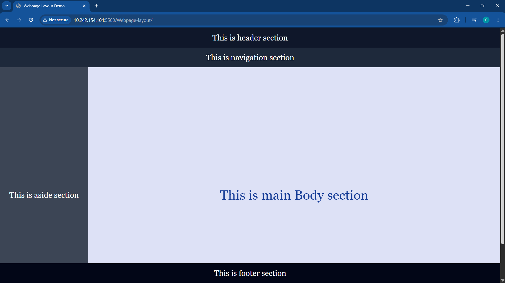

# Webpage layout 
I’ve built a basic webpage layout using HTML & CSS, including key sections like header, navigation bar, sidebar, main content, and footer.

---
## Language Used
- HTML
- CSS

---
## Clone Repo
```bash
git clone https://github.com/samrudhigarad-11/Webpage-layout.git
```

---

# Learning Outcome
- Learned HTML structure
- Understood layout design using CSS

---

# Preview



